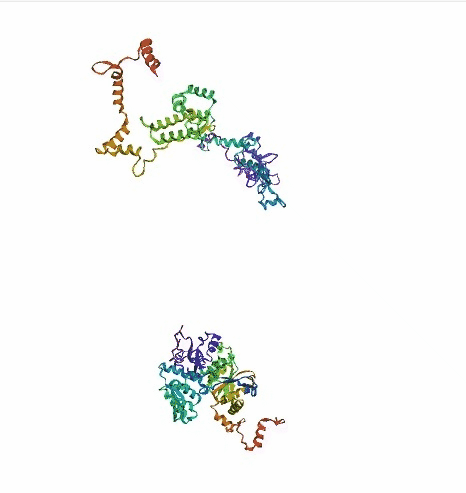
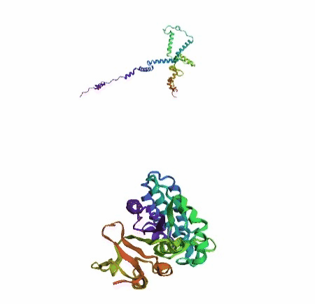
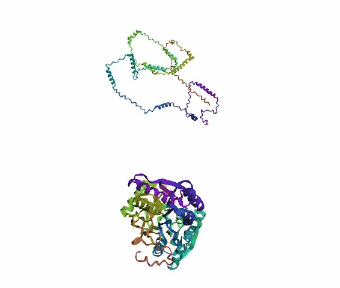
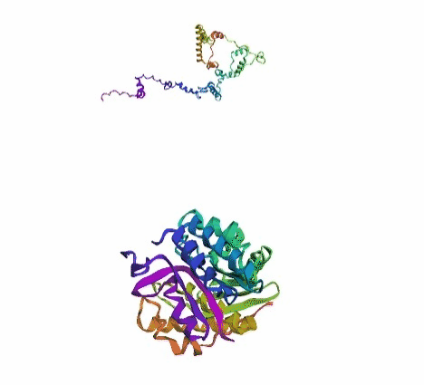
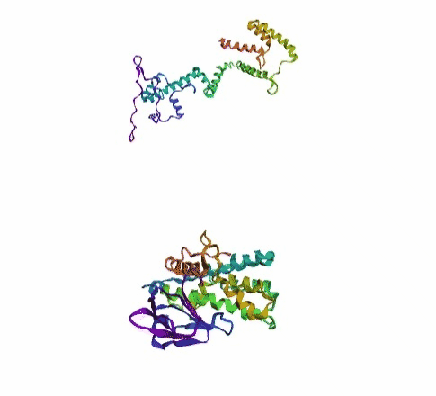
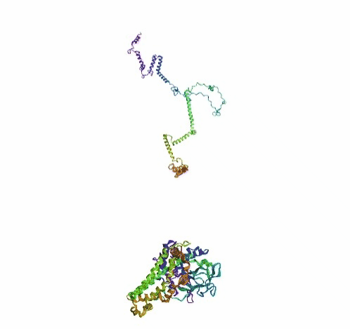
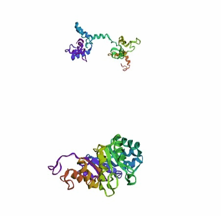
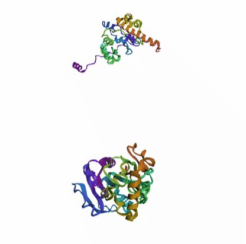

# Attention Based Protein Structure Prediction
<br>

# Introduction
Proteins are essential to life, and understanding their structure can facilitate a mechanistic understanding of their function. Through an enormous experimental effort, the structures of around 100,000 unique proteins have been determined5, but this represents a small fraction of the billions of known protein sequences. Each one has a unique 3D shape that determines how it works and what it does.

But figuring out the exact structure of a protein remains an expensive and often time-consuming process, meaning we only know the exact 3D structure of a tiny fraction of the proteins known to science.

**If we could unravel a protein we would see that it’s like a string of beads made of a sequence of different chemicals known as amino acids.**

DeepMind started working on this challenge in 2016 and have since created an AI system known as AlphaFold. It was taught by showing it the sequences and structures of around 100,000 known proteins.
Experimental techniques for determining structures are painstakingly laborious and time consuming (sometimes taking years and millions of dollars). Their latest version can now predict the shape of a protein, at scale and in minutes, down to atomic accuracy. This is a significant breakthrough and highlights the impact AI can have on science. A system like AlphaFold that is able to accurately predict the structure of proteins could accelerate progress in many areas of research that are important for society.

In this Notebook we have not implmented AlphaFold but a Attention based model which successfully predicts protein structure. Unlike Alphafold `MSA( Multiple Sequence Alignment )` and `ESM` enbeddings have not used or utilized in our model.

# Background

Protein structure prediction is the task of predicting the 3-dimensional structure (shape) of a protein given its amino acid sequence and any available supporting information. In this section, we will:


*   Install and inspect `sidechainnet`, a dataset with tools for predicting and inspecting protein structures,

*   Complete two simplified implementations of `Attention based Networks` for predicting protein angles from amino acid sequences,

* And visualize our predictions along the way.

Note that in the below example, we will not be training a model using atomic coordinates due to the computationally expensive nature of the angles -> coordinates conversion.


# Dataset

We have used `sidechainnet` to train machine learning models to predict protein structure (angles or coordinates) from amino acid sequences. These examples are close to what we would consider the minimum required for complete model training.

The cells below train on the `debug` dataset by default. Feel free to modify the call to `scn.load` to select another SidechainNet dataset like CASP12.

For this tutorial, we will work with two simplified recurrent neural networks to predict angle representations of proteins from their amino acid sequences:


1.   A sequence + `PSSM` `ProteinNet` model:
  - takes as input a concatenation of the amino acid sequence (one-hot vectors, $ℝ^{20}$), the Position Specific Scoring Matrix ($ℝ^{20}$), and the information content ($ℝ^{1}$).
2.   A sequence only `ProteinNet` model:
  - takes takes as input amino acid sequences rerpesented as integer tensors ($ℝ^{1}$).
  
  
Amino acid sequences are consumed by the internal RNN, and vectors of angles are produced for each amino acid. In AlQuraishi's models, only 3 angles were utilized. In our case, we can predict the 12 angles provided by SidechainNet.


# Demo Notebook
Link to demo Kaggle Notebook - [Attention Based Protein Structure Prediction](https://www.kaggle.com/code/basu369victor/attention-based-protein-structure-prediction)

Note: The Notebook might take some time to load depending on your PC, as there are multiple interactive 3D plots. Please bear until the entire page loads.

# Install
```shell
$ pip install -r requirements.txt
```
# Training with PSSMs
 Input -> (Sequences, PSSMs, Secondary Structures, and Information Content)

Target-> Angles

**Model inputs:**
 

*   Adds PSSMs, secondary structure, and information content to the model input by accessing the `batch.seq_evo_sec` attribute, 
*   Uses the smallest version of the CASP 12 dataset (CASP 12, 30% thinning), and
*  Increases the size of the model by increasing the hidden state dimension to 1024.


**What's a PSSM?**

A PSSM is a Position Specific Scoring Matrix (often called a Position Weight Matrix or Position Probability Matrix in DNA-speak).

Images like the one below which visualizes how frequently a particular sequence element is observed at a given position when comparing many similar sequences in an alignment. The image and matrix shown below contain such data for DNA sequences. We are simply utilizing the same kind of data, but for protein sequences!
It visualizes how frequently a particular sequence element is observed at a given position when comparing many similar sequences in an alignment. The image and matrix shown below summarize such data for DNA sequences. We are simply utilizing the same kind of data, but for protein sequences!


*Images by Gnomehacker at English Wikipedia, CC BY-SA 3.0, https://commons.wikimedia.org/w/index.php?curid=34623350)*


Given that PSSMs and sequences both have dimensionality of 20, secondary structure has 8 possible labels, and the information content per residue is a scalar, **what is the correct input dimensionality of this model (`d_in`) assuming these items are concatenated into a single tensor?**

The correct value for `d_in` should be `49`.

``` python
python main.py --mode pssms --train True \
    --epoch 10 --batch 4 --d_in 49 \
    --d_hidden 512 --dim 256 \
    --d_embedding 32 --n_heads 8 \
    --h_dim 64 --integer_sequence False --model_save_path './models'
```
# Training with Protein Sequence

**Information Flow**

Without modifying the output of the model, this image describes the output of a simple Transformer(Attention) model that operates on sequence data.


**Handling the circular nature of angles**

Because a simple Mean-Squared Error (MSE) loss function won't understand that the angles $\pi$ and $-\pi$ are the same, we will predict the `sin` and `cos` values for each angle, and use the `atan2` function to recover the angles after they are predicted by the model. 

This means the model output should be in the shape of $ L \times 12 \times 2$ with values between $[-1,1]$.


``` python
python main.py --mode seqs --train True \
    --epoch 10 --batch 4 --d_in 49 \
    --d_hidden 512 --dim 256 --d_embedding 32 \
    --n_heads 8 -h_dim 64 --integer_sequence True \
    --model_save_path './models'
```

# Inference
During Inference the saved model weight is loaded from directory and used to predict the protein angle and save the output plot. The 3d plots are saved to `"./plots"` directory by default.
``` python
python main.py --model_save_path './models' \
    --integer_sequence False \
    --train False --idx 0 --mode 'pssms'
```
For, Protein sequence model
``` python
python main.py --model_save_path './models' \
    --integer_sequence True \
    --train False --idx 0 --mode 'seqs'
```
The saved 3D-plots could be visualized by the following code on ipython notebook.
``` python
import main

idx=0
main.plot_protein('./plots/{}_pred.pdb'.format(idx), 
                  './plots/{}_true.pdb'.format(idx))
```

# Results
In the below visualized examples we compare our model's predicted protein structure with the actual protein structure. For each example the top 3d plot displays model's prediction and bottom plot visualizes the real protein structure.

<br>

<br>

<br>

<br>

<br>

<br>

<br>

<br>

<br>

# Conclusion

* We successfully implemented an attention-based model that accurately predicts Protein structure.
* We trained our model in two ways, one by having the Secondary protein structure matrix as input and the other by taking the Protein sequence as input.
* The model performance could be improved by using MSA as training data.
* Also, In this approach we are calculating Angles as the target, which could be replaced by coordinate distance and coordinates for better and accurate protein structure prediction.

# References
* [SidechainNet is a protein structure prediction dataset that directly extends ProteinNet1 by Mohammed AlQuraishi.](https://github.com/jonathanking/sidechainnet)
* [Highly accurate protein structure prediction with AlphaFold](https://www.nature.com/articles/s41586-021-03819-2_reference.pdf)
* [Accurate Protein Structure Prediction by Embeddings and Deep Learning Representations](https://arxiv.org/pdf/1911.05531v1.pdf)
* [SidechainNet Tutorial - CCB Skills Seminar](https://colab.research.google.com/drive/178vGN5aMD_gmS0Z4XbFWMbUZu3xHAWmD?usp=sharing)